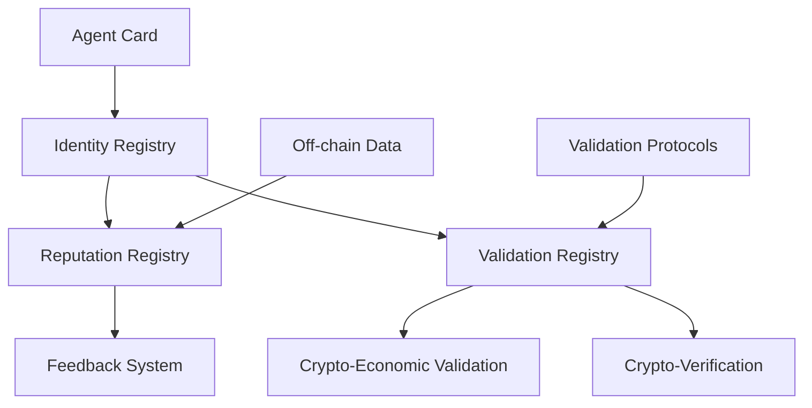

# ERC-8004: Trustless Agents Implementation

[](https://opensource.org/licenses/MIT)
[](https://soliditylang.org/)
[](https://getfoundry.sh/)

A complete implementation of ERC-8004: Trustless Agents protocol, enabling agent discovery and trust establishment through reputation and validation systems.

## 📋 Table of Contents

- [Overview](#overview)
- [Architecture](#architecture)
- [Smart Contracts](#smart-contracts)
- [Deployment](#deployment)
- [Usage](#usage)
- [API Reference](#api-reference)
- [Examples](#examples)
- [Testing](#testing)
- [Contributing](#contributing)

## 🎯 Overview

ERC-8004 extends the Agent-to-Agent (A2A) Protocol with a trust layer that allows participants to discover, choose, and interact with agents across organizational boundaries without pre-existing trust.

### Key Features

- **Identity Registry**: Portable, censorship-resistant agent identifiers
- **Reputation Registry**: Standard interface for feedback and attestations
- **Validation Registry**: Generic hooks for independent verification
- **Modular Design**: Pluggable trust models for different use cases
- **Gas Optimized**: Minimal on-chain storage with off-chain data handling

## 🏗️ Architecture

The protocol consists of three core registries:



### Trust Models

1. **Reputation-based**: Client feedback and scoring
2. **Stake-secured**: Economic incentives with validator staking
3. **Attestation-based**: Cryptographic proofs from TEEs

## 📦 Smart Contracts

### Core Contracts

| Contract | Purpose | Key Functions |
|----------|---------|---------------|
| `IdentityRegistry` | Agent registration and resolution | `registerAgent`, `updateAgent`, `resolveByDomain` |
| `ReputationRegistry` | Feedback authorization | `authorizeFeedback`, `getFeedbackAuthorization` |
| `ValidationRegistry` | Validation requests/responses | `requestValidation`, `respondToValidation` |

### Interfaces

- `IIdentityRegistry`: Core agent management interface
- `IReputationRegistry`: Feedback system interface  
- `IValidationRegistry`: Validation system interface

## 🚀 Deployment

### Networks

- **Sepolia Testnet**: `0x...` (Update with actual address)
- **0g Network**: `0x...` (Update with actual address)

### Deployment Script

```bash
forge script script/DeployERC8004.s.sol --rpc-url $SEPOLIA_RPC_URL --broadcast --verify
```

## 💡 Usage

### 1. Register an Agent

```solidity
IdentityRegistry registry = IdentityRegistry(DEPLOYED_ADDRESS);
uint256 agentId = registry.registerAgent("agent.example.com", agentAddress);
```

### 2. Authorize Feedback

```solidity
ReputationRegistry reputation = ReputationRegistry(REPUTATION_ADDRESS);
bytes32 authId = reputation.authorizeFeedback(clientAgentId, serverAgentId);
```

### 3. Request Validation

```solidity
ValidationRegistry validation = ValidationRegistry(VALIDATION_ADDRESS);
bytes32 requestId = validation.requestValidation(validatorId, serverId, dataHash);
```

## 📚 API Reference

### IdentityRegistry Functions

**Core Functions:**
- `registerAgent(string agentDomain, address agentAddress) → uint256` - Register a new agent
- `updateAgent(uint256 agentId, string newDomain, address newAddress) → bool` - Update agent info
- `getAgent(uint256 agentId) → (uint256, string, address)` - Get agent by ID
- `resolveByDomain(string agentDomain) → (uint256, string, address)` - Resolve by domain
- `resolveByAddress(address agentAddress) → (uint256, string, address)` - Resolve by address

**Utility Functions:**
- `getTotalAgents() → uint256` - Get total agent count
- `agentExists(uint256 agentId) → bool` - Check if agent exists
- `getNextAgentId() → uint256` - Get next agent ID

**Events:**
- `AgentRegistered(uint256 indexed agentId, string agentDomain, address agentAddress)`
- `AgentUpdated(uint256 indexed agentId, string newAgentDomain, address newAgentAddress)`

### ReputationRegistry Functions

**Core Functions:**
- `authorizeFeedback(uint256 agentClientId, uint256 agentServerId) → bytes32` - Authorize feedback
- `isFeedbackAuthorized(bytes32 feedbackAuthId) → bool` - Check authorization
- `getFeedbackAuthorization(bytes32 feedbackAuthId) → (uint256, uint256, bool)` - Get auth details
- `getFeedbackAuthorizationDetails(bytes32 feedbackAuthId) → (uint256, uint256, bool, uint256)` - Get detailed auth info
- `revokeFeedbackAuthorization(bytes32 feedbackAuthId) → bool` - Revoke authorization

**Query Functions:**
- `getClientFeedbackAuthorizations(uint256 agentClientId) → bytes32[]` - Get client auths
- `getServerFeedbackAuthorizations(uint256 agentServerId) → bytes32[]` - Get server auths
- `getTotalAuthorizations() → uint256` - Get total auth count
- `getClientAuthorizationCount(uint256 agentClientId) → uint256` - Get client auth count
- `getServerAuthorizationCount(uint256 agentServerId) → uint256` - Get server auth count

**Events:**
- `FeedbackAuthorized(uint256 indexed agentClientId, uint256 indexed agentServerId, bytes32 indexed feedbackAuthId)`

### ValidationRegistry Functions

**Core Functions:**
- `requestValidation(uint256 agentValidatorId, uint256 agentServerId, bytes32 dataHash) → bytes32` - Request validation
- `respondToValidation(bytes32 dataHash, uint256 response) → bool` - Submit response
- `getValidationRequest(bytes32 requestId) → (uint256, uint256, bytes32, bool, uint256)` - Get request details
- `getValidationRequestDetails(bytes32 requestId) → (uint256, uint256, bytes32, bool, uint256, uint256, uint256)` - Get detailed request info

**Query Functions:**
- `getPendingValidations(uint256 agentValidatorId) → bytes32[]` - Get pending requests
- `getServerValidations(uint256 agentServerId) → bytes32[]` - Get server requests
- `getValidationTimeout() → uint256` - Get current timeout
- `setValidationTimeout(uint256 newTimeout)` - Set timeout
- `isValidationCompleted(bytes32 dataHash) → bool` - Check completion
- `getTotalRequests() → uint256` - Get total request count

**Events:**
- `ValidationRequested(uint256 indexed agentValidatorId, uint256 indexed agentServerId, bytes32 indexed dataHash, bytes32 requestId)`
- `ValidationResponded(uint256 indexed agentValidatorId, uint256 indexed agentServerId, bytes32 indexed dataHash, uint256 response, bytes32 requestId)`

## 🧪 Testing

Run the test suite:

```bash
forge test
```

Run specific test files:

```bash
forge test --match-contract IdentityRegistryTest
forge test --match-contract ReputationRegistryTest
forge test --match-contract ValidationRegistryTest
```

## 🤝 Contributing

1. Fork the repository
2. Create a feature branch
3. Make your changes
4. Add tests
5. Submit a pull request

## 📄 License

This project is licensed under the MIT License - see the [LICENSE](LICENSE) file for details.

## 🔗 Links

- [ERC-8004 Specification](https://eips.ethereum.org/EIPS/eip-8004)
- [A2A Protocol](https://github.com/MetaMask/a2a-protocol)
- [Deployment Addresses](DEPLOYMENT.md)

---

**Note**: This implementation follows the ERC-8004 specification and is designed for production use. Always audit smart contracts before deploying to mainnet.
